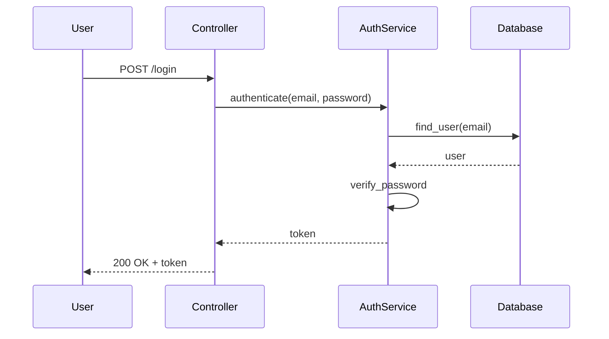
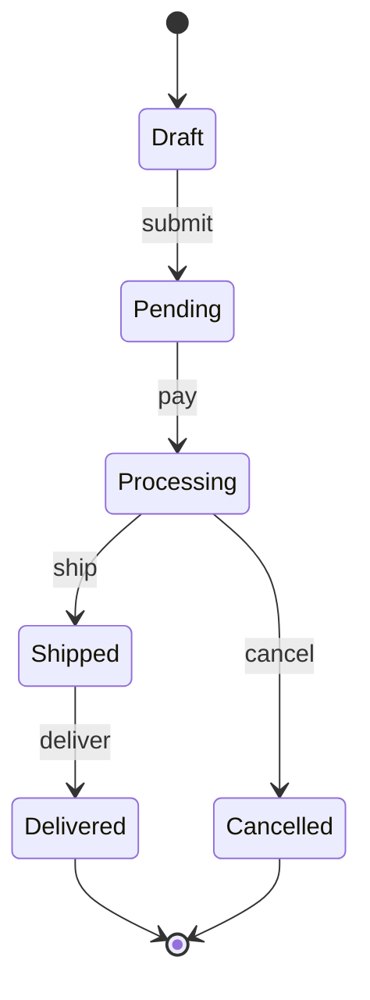
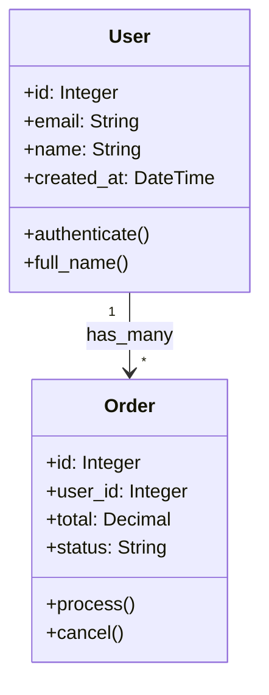

# Mermaid Diagram Generator

Analyze code and generate Mermaid diagrams for visualization and documentation.

## Target selection

The request specifies a target plus a diagram type. Examples:

- `HEAD flow` — flow chart of the last commit
- `app/models/*.rb class` — class diagram for models
- `app/controllers/auth.rb sequence` — sequence diagram for an auth flow
- `db/schema.rb erd` — entity relationship diagram
- `app/models/order.rb state` — state machine diagram
- `app/ architecture` — architecture diagram

If no diagram type is given, auto-detect the most appropriate one (see Smart Detection).

## What it does

1. Analyze the specified code or commits.
2. Identify relationships and flows.
3. Generate appropriate Mermaid diagram syntax.
4. Save to a temp file for easy copying.
5. Include rendering instructions.

## Diagram Types

### Flow Chart

Shows control flow and decision paths: method calls and execution paths, conditional branches, loop structures, error-handling flows, return paths.

### Class Diagram

Shows class relationships and structure: inheritance, module mixins, associations (`has_many`, `belongs_to`), methods and attributes, interfaces and abstractions.

### Sequence Diagram

Shows interaction between components: request/response flows, method call sequences, actor interactions, async operations, error scenarios.

### Entity Relationship Diagram

Shows database structure: table relationships, foreign keys, indexes, data types, cardinality.

### State Machine Diagram

Shows state transitions: states and transitions, events and triggers, guards and conditions, actions and callbacks, terminal states.

### Architecture Diagram

Shows system components: service boundaries, data flow, external dependencies, API integrations, queue/job systems.

## Output Format

Generated diagrams include:

- **Diagram code** in a ```mermaid block.
- **Metadata**: title and description, key/legend if needed, color-coding explanations, complexity warnings.
- **Rendering instructions**: how to view in GitHub/GitLab, VSCode extension recommendations, online editor links, export options.

## Smart Detection

Auto-detect appropriate diagrams when the type is unspecified:

- **Controllers**: sequence diagrams for request handling; flow charts for complex logic.
- **Models**: class diagrams for relationships; state diagrams for status fields; ERD for database structure.
- **Services**: flow charts for business logic; sequence diagrams for external calls.
- **Background jobs**: flow charts with retry logic; state diagrams for job status.

## Advanced Features

- **Customization**: `flow detailed` (all branches), `class minimal` (public interface only), `sequence errors` (error paths).
- **Multiple files**: combine several globs (e.g. `"app/models/*.rb app/services/*.rb" class`), show inter-file relationships, group by namespace.
- **Commit-based**: `HEAD flow` (last commit), `HEAD~5..HEAD class` (changes over 5 commits).

## Examples

### Authentication Flow



### Order State Machine



### Model Relationships



## Requirements

- Analyze Ruby/Rails code structure.
- Understand ActiveRecord associations.
- Detect state machines and workflows.
- Identify service interactions.
- Map database relationships.

## Notes

- Optimize diagrams for clarity over completeness.
- Simplify complex flows for readability.
- Include comments explaining non-obvious relationships.
- Follow Mermaid best practices for rendering.
- Output can be pasted directly into markdown files.
